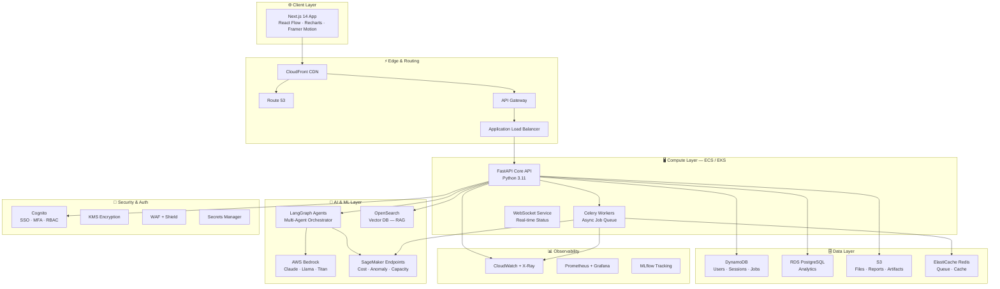
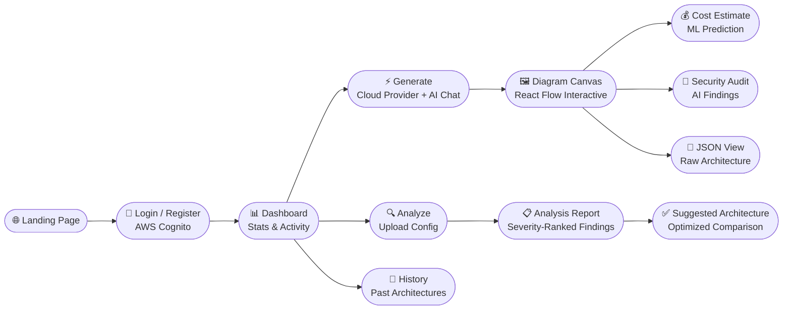
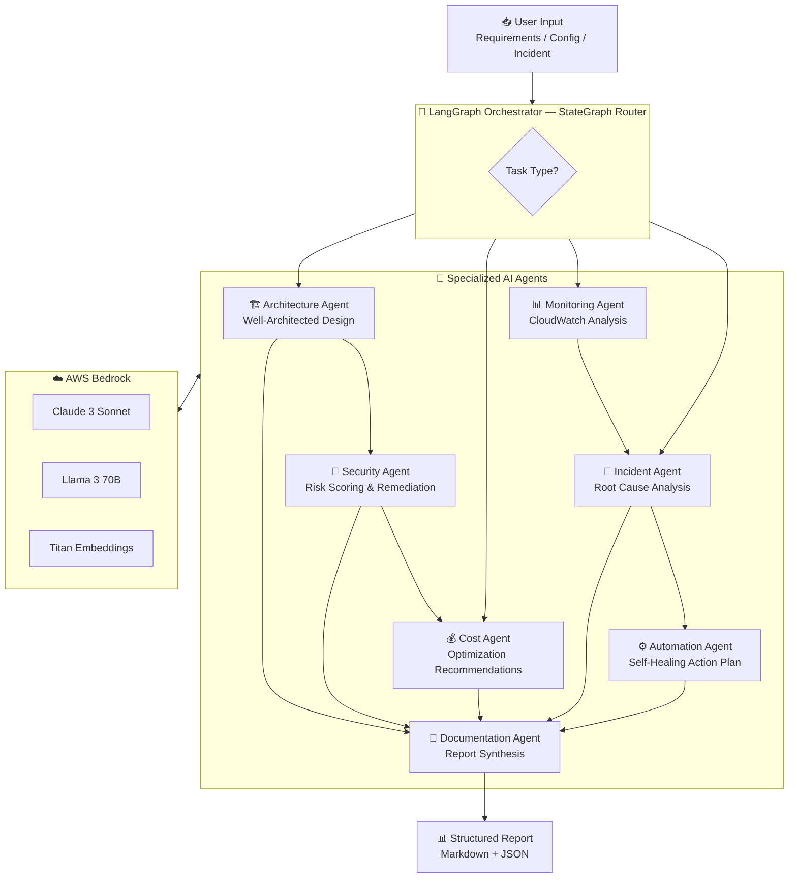
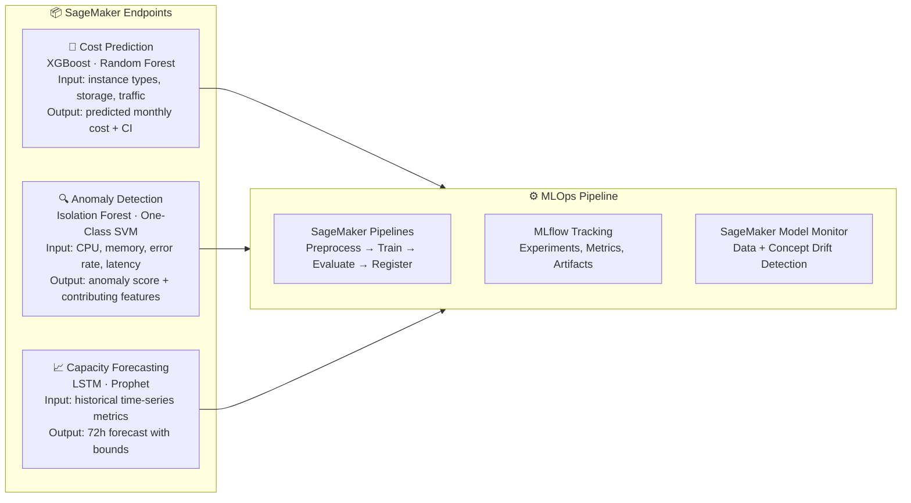
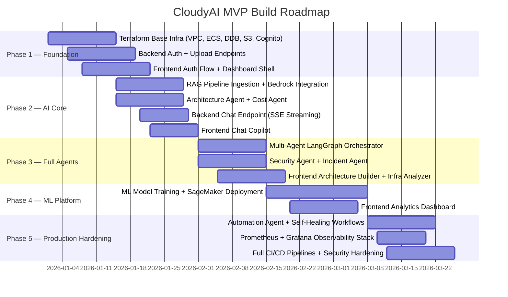

<div align="center">

<!-- Hero Banner -->


<!-- Badges Row 1 -->
<p>
  
  
  
  
</p>

<!-- Badges Row 2 -->
<p>
  
  
  
  
  
  
  
  
  
</p>

<br/>

> **"From Idea to Infrastructure — Intelligently Architected."**
>
> CloudyAI is an enterprise-grade, AI-native platform that transforms plain English descriptions into production-ready cloud architectures — complete with cost forecasts, security audits, and self-healing automation agents.

<br/>

[**🚀 Live Demo**](#) · [**📖 Documentation**](#) · [**🐛 Report a Bug**](../../issues) · [**✨ Request a Feature**](../../issues) · [**💬 Discussions**](../../discussions)

</div>

---

## 📌 Table of Contents

- [What is CloudyAI?](#-what-is-cloudyai)
- [Core Features](#-core-features)
- [System Architecture](#-system-architecture)
- [Tech Stack](#-tech-stack)
- [Application Flow](#-application-flow)
- [AI Agent Pipeline](#-ai-agent-pipeline)
- [ML Models](#-ml-models)
- [Repository Structure](#-repository-structure)
- [Getting Started](#-getting-started)
- [Environment Variables](#-environment-variables)
- [Team](#-team)
- [Branch Strategy](#-branch-strategy)
- [Roadmap](#-roadmap)
- [Contributing](#-contributing)
- [License](#-license)

---

## 🌩 What is CloudyAI?

**CloudyAI** (internal codename: *CloudDaddy*) is a production-grade, full-stack **AI Cloud Architecture Intelligence Platform**. It is not a chatbot. It is a multi-agent, multi-module intelligent system that allows organizations to:

- 🏗️ **Design** full cloud architectures from plain-English business requirements
- 🔍 **Analyze** uploaded infrastructure configs (Terraform, CloudFormation, Kubernetes YAML)
- 💸 **Predict** monthly cloud costs using custom-trained ML models before a single resource is provisioned
- 🔐 **Audit** security posture across IAM, networking, storage, and encryption configurations
- 📈 **Forecast** traffic spikes, CPU exhaustion, and capacity limits before they occur
- 🚨 **Diagnose** incidents through agentic root-cause analysis reading CloudWatch logs in real time
- 🤖 **Automate** self-healing workflows — scaling, rollbacks, credential rotation — with human-approval gates

**Target Users:** Cloud architects · DevOps engineers · CTOs · Infrastructure leads at mid-to-large engineering organizations

**Positioning:** An AI cloud advisor that runs 24/7 inside your infrastructure — not a dashboard, not a chatbot — an intelligent peer.

---

## ✨ Core Features

<table>
<tr>
<td width="50%">

### 🏗️ AI Architecture Designer
Describe your application in plain English. CloudyAI generates a complete cloud architecture — compute layer, database selection, networking, autoscaling, CDN, caching, and VPC layout — with an interactive diagram, cost estimate, and tradeoff analysis.

</td>
<td width="50%">

### 🔍 Infrastructure Analyzer
Upload Terraform HCL, CloudFormation templates, or Kubernetes YAML. The AI parses and analyzes configs to detect over-provisioned resources, exposed buckets, missing WAF, insecure IAM policies, and redundant services.

</td>
</tr>
<tr>
<td>

### 💸 Cost Optimization Engine (ML)
XGBoost + Random Forest models predict monthly AWS spend. Prophet models forecast future cost trends. AI recommendations cover Reserved Instances, Spot usage, right-sizing, serverless alternatives, and cache layers.

</td>
<td>

### 🔐 Security Risk Intelligence
An AI security audit agent checks IAM policies, open ports, exposed APIs, public S3 buckets, missing KMS encryption, and secret leaks. Isolation Forest ML flags unusual infrastructure access patterns in real time.

</td>
</tr>
<tr>
<td>

### 🚨 Incident Response Agent
When degradation occurs, the Incident Agent reads CloudWatch logs, performs root-cause analysis, and generates a structured incident summary with immediate fix recommendations — optionally alerting via Slack or PagerDuty.

</td>
<td>

### 💬 Architecture Q&A Copilot
A RAG-based chat assistant trained on AWS documentation and architecture best practices. Ask "Why use ECS over EKS?" and receive grounded, cited answers. Streaming responses via SSE. Context-aware conversation history.

</td>
</tr>
<tr>
<td>

### 📈 Predictive Capacity Planning
LSTM, XGBoost, and Prophet models predict traffic spikes, CPU exhaustion, memory overflow, and storage limits ahead of time. Output is a dashboard with future capacity projections and recommended pre-scaling actions.

</td>
<td>

### 🤖 Self-Healing Automation Agent
The most advanced feature. When triggered, this agent can automatically restart unhealthy services, scale EC2 instances, rotate credentials, trigger deployment rollbacks, and open Jira tickets — with configurable human-approval gates.

</td>
</tr>
</table>

---

## 🏛️ System Architecture



---

## 🛠️ Tech Stack

<table>
<thead>
<tr>
<th>Layer</th>
<th>Technology</th>
<th>Purpose</th>
</tr>
</thead>
<tbody>
<tr>
<td><b>🎨 Frontend</b></td>
<td>

`Next.js 14` `TypeScript` `TailwindCSS` `shadcn/ui` `React Flow` `Recharts` `Framer Motion`

</td>
<td>App router UI, interactive canvas, charts, animations</td>
</tr>
<tr>
<td><b>⚙️ Backend</b></td>
<td>

`FastAPI` `Python 3.11` `Celery` `Redis` `WebSockets` `Pydantic`

</td>
<td>REST API, async workers, SSE streaming, job queue</td>
</tr>
<tr>
<td><b>🔐 Auth</b></td>
<td>

`AWS Cognito` `JWKS RS256` `MFA` `RBAC`

</td>
<td>SSO, token management, role-based access control</td>
</tr>
<tr>
<td><b>🤖 LLM</b></td>
<td>

`AWS Bedrock` `Claude 3 Sonnet` `Llama 3 70B` `Amazon Titan`

</td>
<td>Architecture generation, analysis, Q&A, incident response</td>
</tr>
<tr>
<td><b>🧠 AI Agents</b></td>
<td>

`LangGraph` `LangChain` `PromptTemplates` `Structured Output`

</td>
<td>Multi-agent orchestration, conditional routing, stateful pipelines</td>
</tr>
<tr>
<td><b>🔎 RAG</b></td>
<td>

`OpenSearch` (vector engine) `Titan Embeddings` `LangChain`

</td>
<td>Knowledge retrieval, AWS doc search, architecture Q&A</td>
</tr>
<tr>
<td><b>📊 ML Models</b></td>
<td>

`XGBoost` `Random Forest` `Prophet` `LSTM (Keras)` `Isolation Forest`

</td>
<td>Cost prediction, anomaly detection, capacity forecasting</td>
</tr>
<tr>
<td><b>🧪 MLOps</b></td>
<td>

`AWS SageMaker` `MLflow` `SageMaker Pipelines` `Model Monitor`

</td>
<td>Training, deployment, drift detection, experiment tracking</td>
</tr>
<tr>
<td><b>🗄️ Databases</b></td>
<td>

`DynamoDB` `RDS PostgreSQL` `ElastiCache Redis`

</td>
<td>Primary data store, analytics, caching & task queue</td>
</tr>
<tr>
<td><b>☁️ Infrastructure</b></td>
<td>

`Terraform` `Docker` `Kubernetes (EKS)` `ECS` `ECR`

</td>
<td>Infrastructure as Code, containerization, orchestration</td>
</tr>
<tr>
<td><b>🚀 CI/CD</b></td>
<td>

`GitHub Actions` `AWS CodePipeline` `CodeBuild`

</td>
<td>Automated testing, building, and deployments</td>
</tr>
<tr>
<td><b>📡 Networking</b></td>
<td>

`VPC` `API Gateway` `Route53` `CloudFront` `ALB` `WAF` `Shield`

</td>
<td>Secure, globally distributed, DDoS-protected network layer</td>
</tr>
<tr>
<td><b>📊 Observability</b></td>
<td>

`CloudWatch` `X-Ray` `Prometheus` `Grafana` `MLflow`

</td>
<td>Distributed tracing, dashboards, alerting, model monitoring</td>
</tr>
<tr>
<td><b>🔑 Security</b></td>
<td>

`IAM` `KMS` `Secrets Manager` `WAF` `Shield` `Cognito`

</td>
<td>Least-privilege access, encryption at rest/transit, DDoS protection</td>
</tr>
<tr>
<td><b>📨 Messaging</b></td>
<td>

`AWS SQS` `AWS SNS`

</td>
<td>Async job dispatch, incident alerting</td>
</tr>
</tbody>
</table>

---

## 🗺️ Application Flow



---

## 🤖 AI Agent Pipeline

CloudyAI's intelligence is powered by a **LangGraph multi-agent system** with 7 specialized agents orchestrated by a central StateGraph router.



### Agent Responsibilities

| Agent | Input | Output |
|---|---|---|
| 🏗️ **Architecture Agent** | Business requirements or parsed config | React Flow diagram JSON, explanation, cost estimate |
| 🔐 **Security Agent** | Architecture or config dict | Findings list with severity scores and remediation steps |
| 💰 **Cost Agent** | Architecture output | Current vs. optimized cost estimate, savings potential |
| 📊 **Monitoring Agent** | CloudWatch metrics data | Health status, alerts, anomaly flags |
| 🚨 **Incident Agent** | Log lines, metrics, description | Root cause, timeline, recommended actions |
| ⚙️ **Automation Agent** | Incident summary or recommendations | Action plan with human-approval flags |
| 📄 **Documentation Agent** | All agent outputs | Unified markdown report with executive summary |

---

## 📊 ML Models

Three custom-trained machine learning models are deployed on **AWS SageMaker** and integrated into the platform.



| Model | Algorithm | Key Features | Target Metric |
|---|---|---|---|
| **Cost Prediction** | XGBoost + Random Forest | instance type, vCPU, RAM, storage, bandwidth | `monthly_cost_usd` (RMSE / MAE / R²) |
| **Anomaly Detection** | Isolation Forest + One-Class SVM | CPU, memory, request rate, error rate, p99 latency | `is_anomaly`, `anomaly_score` (F1) |
| **Capacity Forecasting** | LSTM (Keras) + Prophet | timestamp, CPU/memory/storage time series | 72h forecast with confidence bounds (MAPE) |

---

## 📁 Repository Structure

```
cloudyai/
│
├── 🎨 frontend/                    # Next.js 14 App Router application
│   ├── app/
│   │   ├── dashboard/              # Main dashboard with KPI cards
│   │   ├── builder/                # React Flow architecture canvas
│   │   ├── analyzer/               # Config upload & analysis results
│   │   ├── copilot/                # Streaming RAG chat interface
│   │   ├── analytics/              # Cost & capacity charts
│   │   ├── security/               # Security audit findings
│   │   └── incidents/              # Incident center & history
│   ├── components/                 # Reusable UI components
│   ├── lib/api/                    # Axios/fetch wrapper + typed interfaces
│   ├── hooks/                      # Custom React hooks
│   └── stores/                     # Zustand global state
│
├── ⚙️ backend/                     # FastAPI application
│   ├── api/routes/                 # All API endpoint handlers
│   ├── auth/                       # Cognito JWT verification + RBAC
│   ├── services/                   # S3, DynamoDB, SageMaker, CloudWatch wrappers
│   ├── workers/                    # Celery async task definitions
│   ├── schemas/                    # Pydantic request/response models
│   └── core/                       # Config, dependencies, exceptions
│
├── 🤖 ai_agents/                   # LangGraph multi-agent system
│   ├── orchestrator/               # StateGraph router (graph.py)
│   ├── architecture_agent/         # Cloud design agent
│   ├── security_agent/             # Risk scoring agent
│   ├── cost_agent/                 # Cost optimization agent
│   ├── monitoring_agent/           # CloudWatch analysis agent
│   ├── incident_agent/             # Root-cause analysis agent
│   ├── automation_agent/           # Self-healing action planner
│   ├── documentation_agent/        # Report synthesis agent
│   ├── bedrock_client.py           # Reusable Bedrock LLM client
│   └── prompts/                    # All system prompts (.txt)
│
├── 🧪 ml_models/                   # SageMaker ML models
│   ├── cost_prediction/            # XGBoost + Random Forest
│   ├── anomaly_detection/          # Isolation Forest + One-Class SVM
│   └── capacity_forecasting/       # LSTM + Prophet
│
├── 🔎 rag_pipeline/                # RAG knowledge system
│   ├── ingestion/                  # Document loaders & chunking
│   ├── embeddings/                 # Bedrock Titan embeddings + OpenSearch indexing
│   └── retrieval/                  # Similarity search + RAG chain
│
├── 🏗️ infra/                       # Infrastructure as Code
│   ├── terraform/
│   │   ├── modules/                # vpc, ecs, eks, rds, dynamodb, s3, cognito, etc.
│   │   └── environments/
│   │       ├── dev/                # Development .tfvars
│   │       └── prod/               # Production .tfvars
│   └── kubernetes/
│       ├── deployments/            # Backend, Celery, RAG, Agent services
│       ├── services/               # ClusterIP + Ingress configs
│       └── ingress/                # ALB ingress controller
│
├── 📊 monitoring/
│   ├── grafana/                    # Dashboard JSON definitions
│   └── prometheus/                 # Scrape configs for EKS pods
│
├── 🔄 .github/workflows/           # CI/CD pipelines
│   ├── ci.yml                      # Lint, type-check, tests on PR
│   ├── deploy-backend.yml          # ECR push + ECS/EKS update
│   ├── deploy-frontend.yml         # Next.js build + S3 + CloudFront
│   ├── deploy-infra.yml            # Terraform plan + apply
│   └── deploy-ml.yml               # SageMaker model packaging + deploy
│
└── 📖 docs/                        # Architecture documentation
```

---

## 🚀 Getting Started

### Prerequisites

```bash
node >= 20.x
python >= 3.11
docker >= 24.x
terraform >= 1.7.x
aws-cli >= 2.x (configured with appropriate IAM permissions)
```

### 1. Clone the Repository

```bash
git clone https://github.com/your-org/cloudyai.git
cd cloudyai
```

### 2. Frontend Setup

```bash
cd frontend
npm install
cp .env.example .env.local
# Fill in NEXT_PUBLIC_API_URL and Cognito config values
npm run dev
```

### 3. Backend Setup

```bash
cd backend
python -m venv venv && source venv/bin/activate
pip install -r requirements.txt
cp .env.example .env
# Fill in AWS credentials, DynamoDB table names, Redis URL
uvicorn main:app --reload --port 8000
```

### 4. Start Celery Worker

```bash
cd backend
celery -A workers.celery_app worker --loglevel=info
```

### 5. AI Agents Setup

```bash
cd ai_agents
pip install -r requirements.txt
cp .env.example .env
# Fill in Bedrock model IDs, OpenSearch endpoint, SageMaker endpoint names
```

### 6. Infrastructure Deployment (Dev)

```bash
cd infra/terraform/environments/dev
terraform init
terraform plan
terraform apply
```

### 7. RAG Pipeline Ingestion

```bash
cd rag_pipeline
python ingestion/ingest.py       # Load and chunk AWS docs
python embeddings/embed_and_index.py  # Embed and index to OpenSearch
```

---

## 🔐 Environment Variables

Each module maintains its own `.env.example`. Below are the key variables required across the platform.

<details>
<summary><b>🎨 Frontend — <code>.env.local</code></b></summary>

```env
NEXT_PUBLIC_API_URL=https://api.cloudyai.yourdomain.com
NEXT_PUBLIC_WS_URL=wss://api.cloudyai.yourdomain.com
NEXT_PUBLIC_COGNITO_USER_POOL_ID=us-east-1_XXXXXXXXX
NEXT_PUBLIC_COGNITO_CLIENT_ID=XXXXXXXXXXXXXXXXXXXXXXXXXX
NEXT_PUBLIC_COGNITO_REGION=us-east-1
```

</details>

<details>
<summary><b>⚙️ Backend — <code>.env</code></b></summary>

```env
AWS_REGION=us-east-1
AWS_ACCESS_KEY_ID=...
AWS_SECRET_ACCESS_KEY=...

COGNITO_USER_POOL_ID=us-east-1_XXXXXXXXX
COGNITO_CLIENT_ID=XXXXXXXXXXXXXXXXXXXXXXXXXX

DYNAMODB_USERS_TABLE=cloudyai-users
DYNAMODB_JOBS_TABLE=cloudyai-jobs
DYNAMODB_CONVERSATIONS_TABLE=cloudyai-conversations

S3_UPLOADS_BUCKET=cloudyai-uploads
S3_REPORTS_BUCKET=cloudyai-reports

REDIS_URL=redis://localhost:6379/0

SAGEMAKER_COST_ENDPOINT=cloudyai-cost-prediction
SAGEMAKER_ANOMALY_ENDPOINT=cloudyai-anomaly-detection
SAGEMAKER_CAPACITY_ENDPOINT=cloudyai-capacity-forecasting

FRONTEND_ORIGIN=https://cloudyai.yourdomain.com
```

</details>

<details>
<summary><b>🤖 AI Agents — <code>.env</code></b></summary>

```env
AWS_REGION=us-east-1
BEDROCK_MODEL_ID=anthropic.claude-3-sonnet-20240229-v1:0
BEDROCK_EMBEDDING_MODEL_ID=amazon.titan-embed-text-v1

OPENSEARCH_ENDPOINT=https://search-cloudyai-xxxx.us-east-1.es.amazonaws.com
OPENSEARCH_INDEX=cloudyai-knowledge

SAGEMAKER_COST_ENDPOINT=cloudyai-cost-prediction
MLFLOW_TRACKING_URI=http://mlflow.internal:5000
```

</details>

---

## 👥 Team

Built with 🔥 by the CloudyAI team — 2026.

<table>
<tr>
<td align="center" width="20%">
  <b>Maitry Patel</b><br/>
  <sub>Team Lead · DevOps Engineer</sub><br/>
  <sub>AWS Infrastructure · Terraform · EKS/ECS · CI/CD · MLOps</sub><br/>
  <code>Branch: dev/devops</code>
</td>
<td align="center" width="20%">
  <b>Vidhi Joshi</b><br/>
  <sub>Frontend Engineer</sub><br/>
  <sub>Next.js · React Flow · UI/UX · Cognito Integration</sub><br/>
  <code>Branch: dev/frontend</code>
</td>
<td align="center" width="20%">
  <b>Shruti Ingle</b><br/>
  <sub>Full-Stack Developer</sub><br/>
  <sub>Frontend + Backend integration · File processing · WebSockets</sub><br/>
  <code>Branch: dev/frontend</code>
</td>
<td align="center" width="20%">
  <b>Krishna Yadav</b><br/>
  <sub>AI / ML Engineer</sub><br/>
  <sub>LangGraph · RAG · AWS Bedrock · SageMaker ML Models</sub><br/>
  <code>Branch: dev/ai-ml</code>
</td>
<td align="center" width="20%">
  <b>Arpit Carpenter</b><br/>
  <sub>Backend Engineer</sub><br/>
  <sub>FastAPI · Celery · DynamoDB · S3 · SageMaker Inference</sub><br/>
  <code>Branch: dev/backend</code>
</td>
</tr>
</table>

---

## 🌿 Branch Strategy

```
main
├── dev/devops      ← Maitry Patel     — AWS infra, Terraform, EKS, CI/CD, MLOps
├── dev/frontend    ← Vidhi + Shruti   — Next.js app, all UI modules, API integration
├── dev/backend     ← Arpit Carpenter  — FastAPI, all endpoints, Celery workers
└── dev/ai-ml       ← Krishna Yadav   — LangGraph agents, RAG pipeline, ML models
```

**Rules:**
- ❌ No direct pushes to `main`
- ✅ All merges require at least one reviewer approval
- ✅ CI must pass (lint + type-check + unit tests) before any merge
- ✅ Squash and merge strategy for all feature branches

### Commit Convention

```bash
feat:     add architecture agent LangGraph node
fix:      correct JWT expiry check in auth middleware
refactor: extract S3 upload logic into service class
chore:    add Terraform module for OpenSearch domain
docs:     update RAG pipeline README
test:     add pytest coverage for file processor service
```

---

## 🗓️ Roadmap & Build Phases



---

## 🤝 Contributing

Contributions are welcome and appreciated. Please follow these steps:

1. Fork the repository
2. Create your feature branch from the appropriate `dev/*` branch
3. Write clean, typed, tested code (TypeScript strict mode / Python type hints)
4. Write or update unit tests for all business logic
5. Ensure your branch passes CI checks (lint, type-check, tests)
6. Open a pull request with a clear description of your changes

Please read the [Contributing Guidelines](CONTRIBUTING.md) and [Code of Conduct](CODE_OF_CONDUCT.md) before submitting.

---

## 📄 License

This project is licensed under the **MIT License** — see the [LICENSE](LICENSE) file for details.

---

<div align="center">

**CloudyAI** — Built by engineers, for engineers.

*AI-native cloud intelligence that thinks before you deploy.*

<br/>


</div>
